# 数组 List (线性表)

[参考Wiki：Linked list](https://www.wikiwand.com/en/Linked_list)
[参考：大话数据结构](https://book.douban.com/subject/6424904/)

List中，元素是**有序**的，**一对一**的衔接的，绝对不能是一对多。每个元素都有固定的index位置。所以元素间是线关系。

List的定义、结构、操作方法：
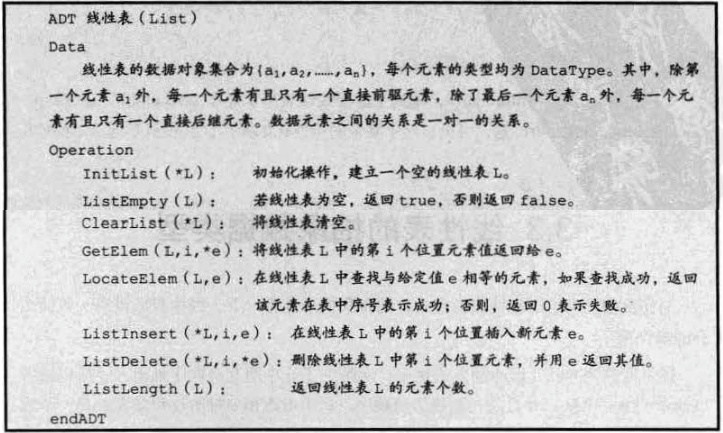

List主要有这两种存储结构：
- 顺序存储结构：每个元素位置都是挨着的。方便查找读取，不方便插入删除。
- 链式存储结构：每个元素位置随机放置，每个节点分别存放数据信息和下一个节点的位置信息。适合插入删除，不适合读取。
    - 单链表
    - 循环链表
    - 双链表

## 顺序存储结构 (顺序表 Sequential List / Array List) 

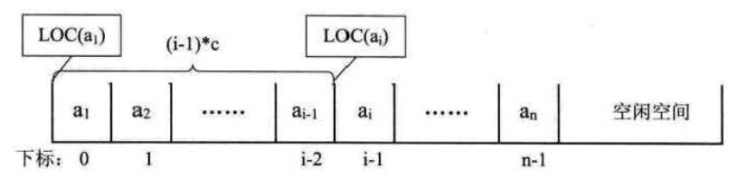

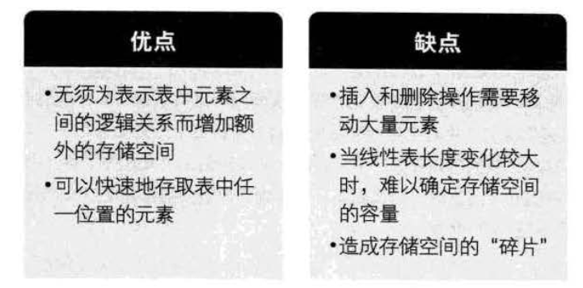

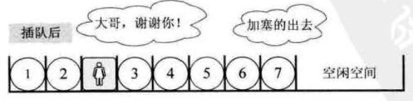

## 链式存储结构的线性表 （单链表 Singly Linked List）

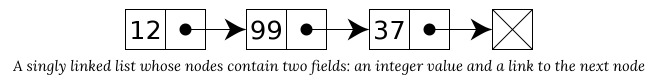

每个node节点包括两部分信息：
- Data 数据：自身包含的数据
- Pointer 指针：下一个node节点的位置

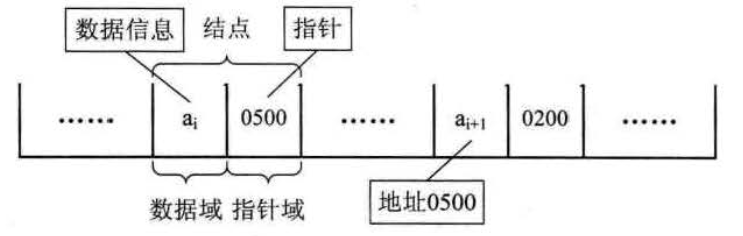

头指针与头节点：
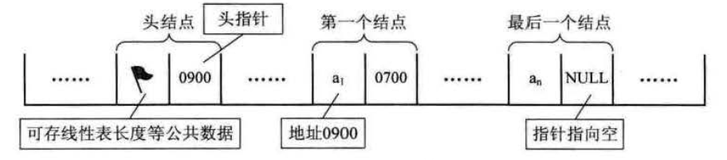

Linked List的读取，必须从头节点开始找，直到找到所需的内容。
一般读取List的某项元素是，是需要指定一个index序号`i`，然后从j=0开始遍历node节点，直到`j=i`位置，就读取当前node的data部分。

## 静态链表 Static Linked List

就是用两个数组，模拟一般`单链表`，一个数组放数据，一个数组放指针。
这种东西一般用来解决某些编程语言没有指针的问题。

## 循环链表 Circular Linked List

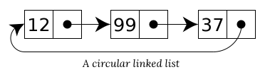

由于`单链表`到了尾节点的指针就指向了null，且每个节点都不知道自己的上一个节点，所以出现一个很大问题就是无法从某节点开始遍历所有节点，只能向后不能向前。

`循环链表`就是把尾指针指向了头指针，这样就形成了一个环。即使方向不能改变，但是仍能从任意节点开始环球一圈，遍历到所有节点。

## 双向链表 Doubly Linked List

双向链表解决了单向链表只能往后不能往前的问题。每个node节点都同时包含"上一个“与"下一个"节点的位置。
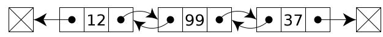

## 总结

Python 内置List的操作时间复杂度：
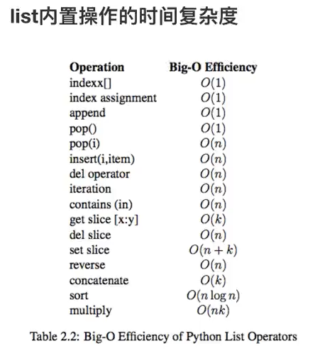

Python内置Dictionary字典的操作时间复杂度：
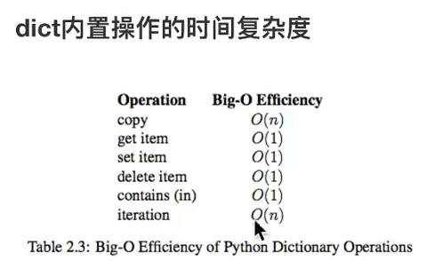

