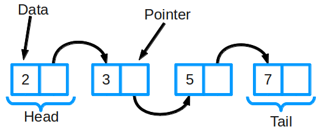
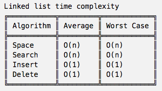

# `Linked List` (Data structure)



## ADT DEFINITION

Singly Linked List:
```py
ADT: <LINKED LIST> (Singly)

    The Linked list has nothing to do with array [1,2,3,4],
    but has of multiple nodes consist of two parts: value and pointer to the next node.
    That being said, 
    the object "LinkedList" has only two properties: length and a pointer to the head.

DATA:
    - Node         # basic element, consists of two parts
        - value    # actual data
        - next     # pointer of the next node
    - LinkedList
        - length
        - head     # pointer of the head node


OPERATIONS:

    addAt(index):
        (*) insert a node at the index, 

    removeAt(index):
        (*) delete a node at the index, 

    indexOf(value):
        (*) return the index of a node has the value. It searches from head.

    elementAt(index):
        (*) return the value of a node at the index. There's a search starts from head.
```

Doubly Linked List:
```py
ADT: <LINKED LIST> (Doubly)

    Doubly linked list has a pointer to the "previous node".

DATA:
    - Node         # basic element, consists of two parts
        - value    # actual data
        - prev     # pointer of the previous node
        - next     # pointer of the next node
    - LinkedList
        - length
        - head     # pointer of the head node
        - tail     # pointer of the tail node
```

Circular Doubly Linked List:
```py
ADT: <LINKED LIST> (Doubly)

    Its properties are the same with Doubly linked list,
    but the operations aren't the same.

DATA:
    - Node         # basic element, consists of two parts
        - value    # actual data
        - prev     # pointer of the previous node
        - next     # pointer of the next node
    - LinkedList
        - length
        - head     # pointer of the head node
        - tail     # pointer of the tail node

```

## IMPLEMENTATION

[Refer to: Linked List BY Beau Carnes (Javascript)](https://codepen.io/beaucarnes/pen/ybOvBq/?editors=0010)

## ANALYSIS



