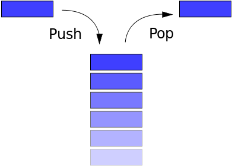
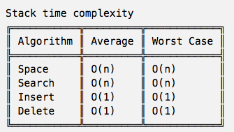

# `Stack` (Data structure)

[Refer to wiki: Stack (abstract data type) ](https://www.wikiwand.com/en/Stack_(abstract_data_type))




## ADT DEFINITION

There're two implementations of Stack: Array and Linked list. 
> Wikipedia: "What identifies the data structure as a stack in either case is not the implementation but the interface: the user is only allowed to pop or push items onto the array or linked list, with few other helper operations. The following will demonstrate both implementations, using pseudocode."

Version of Array:
```py
ADT: <STACK> (array)

DATA:
    - Stack
        - storage []    # an array of values
        - size    # count of elements
        - top    # pointer of top element

OPERATIONS:

    push(value):
        (*) add node on top of the stack.
    
    pop():
        (*) delete the top node.
```

Version of Linked list:
```py
ADT: <STACK> (array)

DATA:
    - Node         # basic element, consists of two parts
        - value    # actual data
        - next     # pointer of the next node
    - Stack
        - size    # counts of all nodes
        - top    # pointer of the top node


OPERATIONS:

    push(value):
        (*) add node on top of the stack.
    
    pop():
        (*) delete the top node.
    
```

## IMPLEMENTATION


## ANALYSIS



