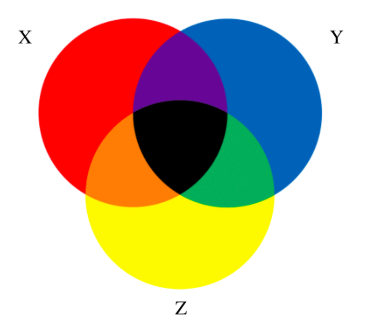

# `Set` (Data structure)




## ADT DEFINITION

```py
ADT: <SET>

    The set data structure stores values without any particular order and with no repeated values.
    Besides being able to add and remove elements to a set, 
    there are a few other important set functions that work with two sets at once.

DATA:
    - Set []     # An array of data without any duplicates.

OPERATIONS:

    union(anotherSet):
        (*) return a new set, with combined values from another set but no duplicates.

    intersection(anotherSet):
        (*) return a new set, with values exist in both sets.

    difference(anotherSet):
        (*) return a new set, with the values does not exist in both sets.

    subset(anotherSet):
        (*) return true, if the current set is a subset of another set.

    add(value):
        add value to the set, if it doesn't exist in the set already.

    remove(value):
        delete the value from set.

    has(value):
        return true if the set contains the value.
```

## IMPLEMENTATION

[Refer to: Sets - Beau Carnes (JS)](https://codepen.io/beaucarnes/pen/dvGeeq?editors=0011)

## ANALYSIS
