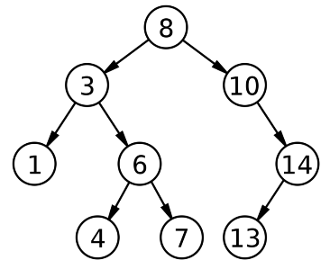
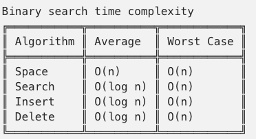

# `Binary Search Tree` (Data structure)




A `tree` is a data structure composed of nodes It has the following characteristics:
- Each tree has a `root node` (at the top).
- The root node has zero or more `child nodes`.
- Each child node has zero or more child nodes, and so on.

A `binary search tree` adds these two characteristics:
- Each node has up to `two children`.
- (*) **For each node, `left child < current < right child`.**

## ADT DEFINITION

```py
ADT: <BINARY SEARCH TREE>

DATA:
    - Node
        - value
        - left child
        - right child
    - BST
        - root    # pointer to the root node

OPERATIONS:

    search(value):
        (*) return the node which has the value. 
            The comparison descents to left if smaller, to right if greater.

    add(value):
        
            
    remove(value):
        
            
    findMin():
        
            
    findMax():
        
            
    isPresent(value):
        
            
    findMaxHeight():
        
            
    findMinHeight():
        
            
    isBalanced():
        
            
    inOrder():
        
            
    preOrder():
        
            
    postOrder():
        
            
    levelOrder():
        
            
    reverseLevelOrder():
        
            
    invert():
        
```

## IMPLEMENTATION

[Refer to Beau Carnes: Binary Search Tree](https://codepen.io/beaucarnes/pen/ryKvEQ?editors=0011)

## ANALYSIS

Binary search trees allow **fast lookup, addition and removal** of items. 
The way that they are set up means that, on average, each comparison allows the operations to skip about `half of the tree`, 
so that each lookup, insertion or deletion takes time proportional to the `logarithm of the number of items` stored in the tree.



