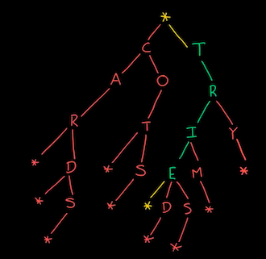

# `Trie` (Data structure)




> It's called the `Trie Search Tree`, "trie" pronounced as "try".

`Trie` is specifically designed for searching for a `word`, rather than a number.
`Word autocompletion` is based on this algorithm.

## ADT DEFINITION
```py
ADT: <TRIE>


DATA:
    - Node
        - keys []    # a Map of key/value pairs, for 
        - isWord     # true if you can spell a word from root to this node

OPERATIONS:

```

## IMPLEMENTATION

[Refer to Beau Carnes: Trie (JS)](https://codepen.io/beaucarnes/pen/mmBNBd?editors=0011)


## ANALYSIS


