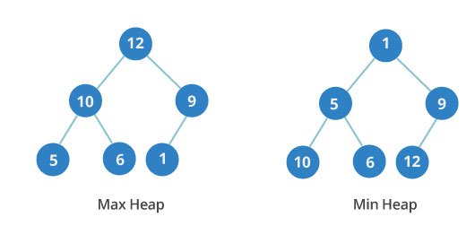
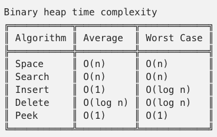

# `Binary Heap Tree` (Data structure)



It's similar to Binary Tree, but different with order.
Its **goal** is to make a `complete tree`, which in `Max Heap` the father node is always greater child node, and new node will fill up the same level regardless of the order and then reach to a deeper level.


## ADT DEFINITION

```py
ADT: <HEAPS>

DATA:


OPERATIONS:

    insert(value):
        Add the value to the binary tree. 
        If the the level is filled up, then reach to the deeper level.

    remove():

    sort():

```


## IMPLEMENTATION

[Refer to Beau Carnes: Heaps (JS)](https://codepen.io/beaucarnes/pen/JNvENQ?editors=0011)

## ANALYSIS



