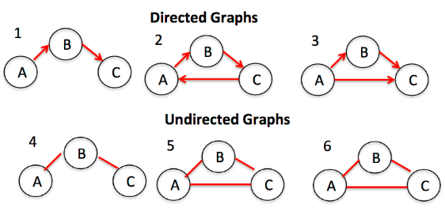
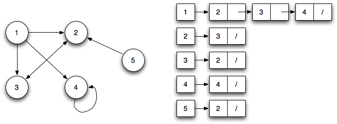
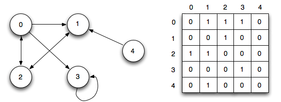
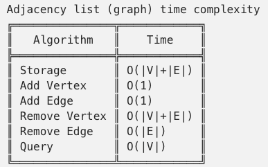

# `Graph` (Data structure)

> Graphs are collections of `nodes` (also called vertices) and the `connections` (called edges) between them. 
Graphs are also known as `networks`.



There are two major types of graphs: 
- `Directed`: graphs with a direction in its edges.
- `Undirected`: graphs without any direction on the edges between nodes.

Two common ways to represent a graph are:
- an `Adjacency List`: a list where the left side is the node and the right side lists all the other nodes it’s connected to.

- an `Adjacency Matrix`: a grid of numbers, where each row or column represents a different node in the graph.



## ADT DEFINITION

```py
ADT: <GRAPH>

DATA:


OPERATIONS:

 
```


## IMPLEMENTATION

[Refer to Beau Carnes: Graphs (JS)](https://codepen.io/beaucarnes/pen/XgrXvw?editors=0011)

## ANALYSIS



