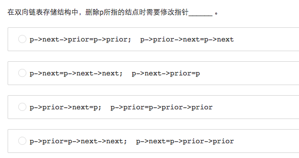
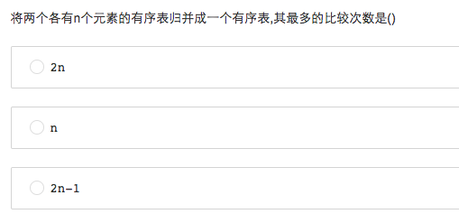
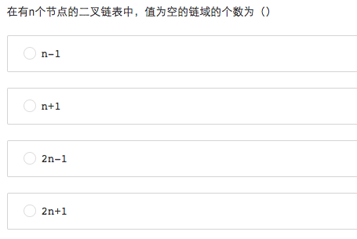
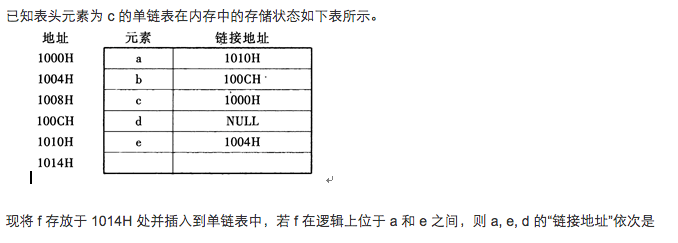
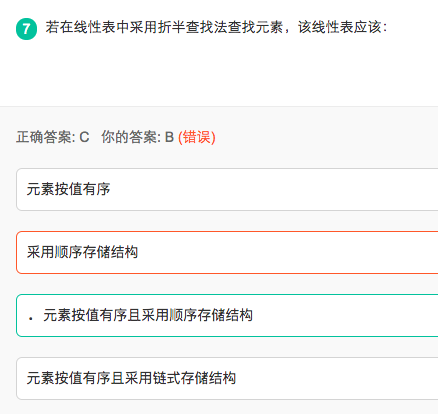
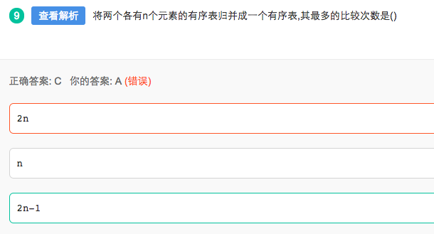

# Tough questions on [Linked List] [DRAFT]

## 在双向链表存储结构中，删除p所指的结点时需要修改指针( )

## 将两个各有n个元素的有序表归并成一个有序表,其最多的比较次数是( )

## 在有n个节点的二叉链表中，值为空的链域的个数为（）

## 已知表头元素为 c 的单链表在内存中的存储状态如下表所示。

## 若在线性表中采用折半查找法查找元素，该线性表应该：

折半查找要求直接访问到中间节点，而链式存储必须遍历整个链表

## 将两个各有n个元素的有序表归并成一个有序表,其最多的比较次数是()

最多的比较次数是当两个有序表的数据刚好是插空顺序的时候，比如：第一个序列是1,3,5，第二个序列是2,4,6，把第二个序列插入到第一个序列中，先把第二个序列中的第一个元素2和第一个序列依次比较，需要比较2次（和1，3比较），第二个元素4需要比较2次（和3,5比较，因为4比2大，2之前的元素都不用比较了），第三个元素6需要比较1次（只和5比较），所以最多需要比较5次。即2n-1次。
