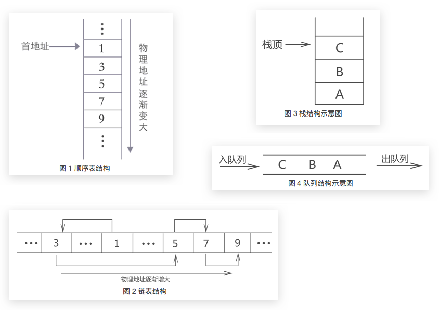
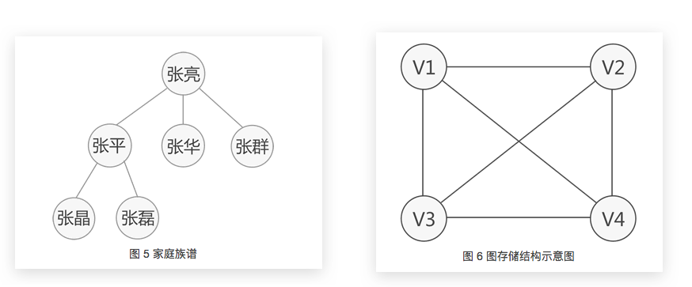

# 数据结构概述：《数据结构与算法教程》学习笔记

[参考原址：数据结构与算法教程，数据结构C语言版教程！——通俗易懂、深入浅出、中文免费、完整示例、基于C语言](http://data.biancheng.net/)

## 数据结构分类

数据结构分为两大类：
- 逻辑结构：即一般而言的各类堆栈树图等逻辑结构。
- 物理结构：即物理存储结构——数据在内存硬盘上是集中存放(`顺序存储`)还是分散存放(`链式存储`)。

逻辑数据结构大致包含以下几种存储结构：
- `线性表`，还可细分为顺序表、链表、栈和队列；
- `树结构`，包括普通树，二叉树，线索二叉树等；
- `图存储结构`；

其中：
- 线性表：适合存储`一对一`关系的数据。各元素依次排列，每个元素前后**有且仅有一个元素**与之相邻。
- 树：适合存储`一对多`关系的数据
- 图：适合存储`多对多`关系的数据

线性表示意图：

树与图的示意图：

## 复杂度计算

> 对于一个问题的算法来说，之所以称之为算法，首先它必须能够解决这个问题（称为准确性）。其次，通过这个算法编写的程序要求在任何情况下不能崩溃（称为健壮性）。如果准确性和健壮性都满足，接下来，就要考虑最重要的一点：通过算法编写的程序，运行的效率怎么样。

运行效率体现在两方面：
- 算法的运行时间。（称为“时间复杂度”）
- 运行算法所需的内存空间大小。（称为“空间复杂度”）

> 好算法的标准就是：在符合算法本身的要求的基础上，使用算法编写的程序运行的时间短，运行过程中占用的内存空间少，就可以称这个算法是“好算法”。

### 常用的时间复杂度的排序

### 时间换空间，用空间换时间

根据自己的资源情况而定。如果相对于数据来说，自己的计算资源较足那么就尽量减少算法的内存空间利用，而集中到CPU上；如果自己的内存资源较足，那么就减少CPU计算而尽量利用内存来存放缓存数据。
